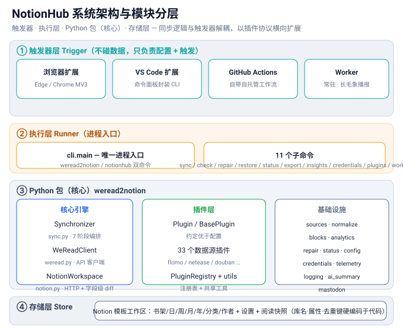
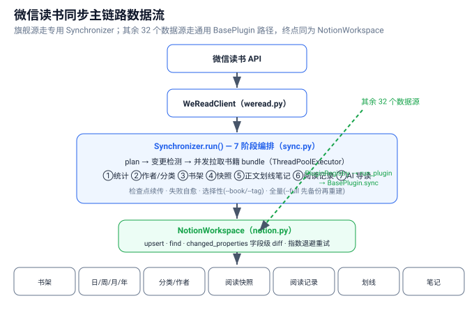

# NotionHub 框架分析与优化路线

> 本文档整理自对 `weread2notion` 核心源码的系统阅读，覆盖整体架构、核心功能机制，以及可继续优化/升级的建议。
> 配套架构图见 [`diagrams/architecture.svg`](diagrams/architecture.svg) 与 [`diagrams/weread-sync-flow.svg`](diagrams/weread-sync-flow.svg)。

## 一、四层框架

### ① 触发器层（Trigger）— 不碰数据，只负责「配置 + 触发」
- **浏览器扩展**（Edge/Chrome MV3，`manifest.json` + `background.js` + `panel.js`）：OAuth 授权 Notion/GitHub、抓取微信读书 Key、校验模板（7 库）、存配置、`workflow_dispatch` 触发同步。
- **VS Code 扩展**（`package.json` + `extension.js`）：把 CLI 子命令包进命令面板（Sync Now / Check / List Plugins…），无 Node 端逻辑。
- **GitHub Actions**（`weread.yml` / `sync.yml`）：本仓库自带工作流，可自托管跑同步，不依赖云端 runner。
- **常驻 Worker**（`worker.py`）：每 5 分钟轮询，可选把结果嘟到 Mastodon。

### ② 执行层（Runner）— 进程入口
`cli.main`（`cli.py`）是唯一进程入口，`pyproject.toml` 暴露两个等价命令 `weread2notion` 与 `notionhub`。它解析 11 个子命令（`sync`/`check`/`repair`/`restore`/`status`/`export`/`insights`/`credentials`/`plugins`/`worker`），组装 `Settings`、建立 `NotionWorkspace`、`run_plugin` 调度插件。

### ③ Python 包（核心）— 三大分区
- **核心引擎**：`Synchronizer`（`sync.py`，934 行 7 阶段编排）、`WeReadClient`（`weread.py`，API 客户端）、`NotionWorkspace`（`notion.py`，HTTP + 字段级 diff）。
- **插件层**：`Plugin` 协议 + `BasePlugin`、`33` 个数据源插件、`PluginRegistry` + `utils`。
- **基础设施**：`sources`/`normalize`/`blocks`/`analytics`/`repair`/`status`/`config`/`credentials`/`telemetry`/`logging_utils`/`ai_summary`/`mastodon`。

### ④ 存储层（Store）— Notion 模板工作区
`REQUIRED_DATABASES` 硬编码 7 个库（书架/日/周/月/年/分类/作者）+ `设置` + `阅读快照`。库名、属性名、去重键都写死在同步代码里，改名即断（换取零配置同步）。

## 二、核心功能机制

### 1. 同步的本质：多源 → Notion 单向同步
NotionHub = "把数字生活汇集进 Notion 的插件枢纽"。以**微信读书**为旗舰源，外加 **33 个数据源插件**（笔记/影音/阅读/播客/效率/学习/运动…），把各自数据汇入一套 Notion 模板（书架/日周月年统计/分类/作者/设置/阅读快照）。入口是 `cli.py` 的 `sync` 命令（→ `Synchronizer`）；其余插件走 `PluginRegistry` + `run_plugin`。

### 2. 增量策略（最值得借鉴）：两级跳过无效写入
- **记录级去重**：`upsert(db, key, value, raw)` 先 `find()` 按唯一键命中已有记录，未命中才 `POST` 创建。各库去重键不同（书架 `BookId`、快照 `SnapshotKey=日期:BookId`、统计用标题、阅读记录用时间戳、作者/分类用名称）。
- **字段级 diff**：`changed_properties(db, existing, desired)` 逐属性比对现有值与目标值（标题/富文本/数字/勾选/状态/多选/日期/关联/链接各有归一化比较），**只对真正变化的属性发 PATCH**；完全无变化连请求都不发。无法可靠比较的类型按"有变化"处理（宁可多写不漏更）；`formula`/`rollup`/`created_time` 等只读属性不参与。

### 3. 插件体系（约定优于配置）
- `Plugin` 协议（Protocol）：`meta` + `is_configured`/`setup`/`discover`/`sync`/`health`。
- `BasePlugin` 把 `setup`/`discover`/`sync`/`health` 的通用实现收归一处（建库、`upsert`、异常隔离、字段级 diff），子类只需声明 `DB_NAME/TITLE_PROP/KEY_PROP/SCHEMA` + 实现 `is_configured` 与 `_items(ctx)->Iterable[(key, raw)]`。
- `PluginRegistry` 集中注册、按 id/category 查找；`run_plugin` 薄封装：注入 `PluginContext(notion, settings, log)` → `is_configured` 否就安全跳过 → `setup` → `sync`。
- `utils.py` 提供共享 `strip_html` / `parse_date_to_iso` / `parse_date_to_timestamp` / `parse_kindle_clipping_date`。

### 4. 数据源抽象（读书标注类）
`BookSource`（`sources.py`）抽象阅读标注来源，`AggregatedBookSource` 把 Kindle/Apple Books 这类"先聚合成 books 字典再实现 `shelf/notebooks/book_bundle/reading_days`"的重复收进基类；`build_source` 按 `--source` 在 weread/local/kindle/apple 间切换。

### 5. 健壮性与可运维性
- **重试**：`NotionWorkspace.request` 指数退避+抖动，尊重 `Retry-After`；429/5xx 重试，校验/权限错误立即抛出。
- **失败自愈**：`sync` 失败自动 `repair --apply` 后重试一次（`_self_heal`）。
- **检查点续传**：`Synchronizer` 按书的 `checkpoint_file` 记录已完成，中断可续。
- **安全重建**：`--full` 先导出 JSON 备份再归档重建，失败可 `restore` 回滚。
- **版本自检**：代码 `SYNC_VERSION` 与设置库记录不一致时告警建议全量。
- **可选增强（默认关闭、优雅降级）**：AI 书摘（`ai_summary.py` + `OPENAI_API_KEY`）、匿名遥测、Mastodon 播报。

### 6. 几个关键设计决策
- 微信读书走**专用 `Synchronizer`**（`sync.py`），其余 32 个数据源走**通用 `BasePlugin`** 路径——因微信读书有章节化划线、人物卡片、阅读快照等复杂结构，强塞进插件协议反而别扭。
- 模板结构**硬编码**于代码（`REQUIRED_DATABASES` / `SNAPSHOTS_PROPERTIES` / 各 schema），换取零配置同步，代价是改名即断。
- 双命令入口 `weread2notion` / `notionhub`，兼容旧 fork 与品牌名。

## 三、可继续优化 / 升级的点（按性价比排序）

### ✅ 已在本轮顺手完成（低风险、零回归，已跑 `pytest` 验证 232 passed / 3 skipped）
1. **消除 `sync.py` 完全重复的库名列表**：全量重建涉及的 12 个数据库名在 `run()` 与 `validate_full_rebuild()` 中逐字重复，已抽到模块级常量 `DATA_DATABASES`（`sync.py` 顶部）。
2. **`pyproject.toml` 补 `pythonpath = ["src"]`**：此前 `pytest` 直接运行会失败，必须靠 `run_tests.py` 注入 `src`；现在开箱即用。
3. **`cli.py` 清理内联 `import sys as _sys`**：改为顶层 `import sys`，消除函数内重复 import 的异味。

### 🟢 高性价比、可安全落地（建议下一步做）
4. **为最复杂的 `Synchronizer` 补专项单测**：全仓 232 个测试里，934 行的 `sync.py` 编排逻辑目前**没有专门的单元测试**（只有 `test_sources.py` 测 `build_source`）。建议用 `FakeWeRead + FakeNotion` 对 `run()` 的变更检测、选择性同步（`--book`/`--tag`）、检查点续传做断言——这是当前最大的测试盲区。
5. **`cli.py` 的 `main()` 巨型 `if command == ...` 分发体**（约 220 行）改为 **命令分发表**（dict of handlers 或 `commands/` 子包）。每加一个子命令就少改一处巨型函数，可读性/可测试性都更好。
6. **统一快照库的建库路径**：`ensure_reading_snapshots()` 有自己一套 bespoke 创建逻辑，而插件走通用的 `ensure_database()`。可让快照库也走通用路径（或把差异收敛为参数），减少"同一件事两种写法"。

### 🟡 中长期、需谨慎设计（建议立项讨论后再动）
7. **拆分 `notion.py` 的"上帝类"**（39KB / `NotionWorkspace` 同时管 HTTP 客户端、schema 发现、设置、快照、AI、属性映射、diff）。可拆为 `client.py`（HTTP/重试）、`schema.py`（discover/properties/property）、`diff.py`（changed_properties/_same_value）、`workspace.py`（编排）。收益大但对所有同步路径都有侵入，需配套回归测试。
8. **拆分 `sync.py` 的 `Synchronizer`**（934 行）。7 个阶段已是清晰的方法，但可进一步抽成 `stages.py` 中的阶段函数 / 流水线对象，让单阶段可独立测试。
9. **模板结构外置为 manifest**（JSON/YAML）：把 `REQUIRED_DATABASES`、各库 schema、去重键抽成 `template.py` 清单，模板变更不再需要改同步代码——这是"改名即断"问题的根治方案，但属于架构级改动，需评估迁移成本。
10. **Worker 缓存 `NotionWorkspace.discover()`**：`run_cycle()` 每轮都重建客户端并重新拉取全部库 schema，可缓存并在 schema 版本变化时才刷新，降低 5 分钟轮询的 API 消耗。

### 🔍 值得注意的小观察（非紧急）
- `cli.py` 的 `plugins info` 分支会**新建一个 `NotionWorkspace` 却未调用 `.discover()`**，而 `health`/`info` 实际上不依赖它——此处构造可以省掉，避免无谓对象创建。
- `worker.py` 每轮 `run_cycle` 都重新 `discover()` 全部数据库 schema，频繁轮询下略显浪费（见第 10 点）。

## 四、一句话总结
NotionHub 是一套「**触发器与同步逻辑分离、以插件协议统一多数据源、以字段级 diff 实现高效增量写入**」的 Notion 同步枢纽——核心引擎（`Synchronizer` + `NotionWorkspace`）负责微信读书的复杂编排，插件层（`BasePlugin` + 33 插件 + `Registry`）负责横向扩展，共享工具与数据源抽象消除重复。整体已是"基类约定 + 工具集中复用 + 测试防护"的一致结构，后续优化重点应放在**测试盲区补全（尤其是 `sync.py`）**与**两个上帝类的可控拆分**上。
