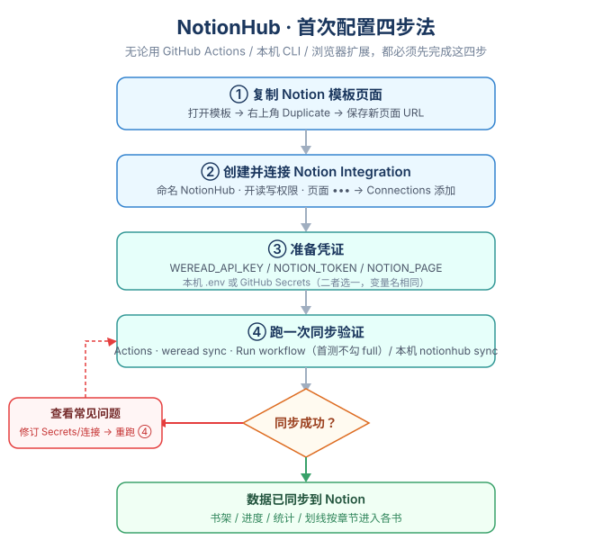
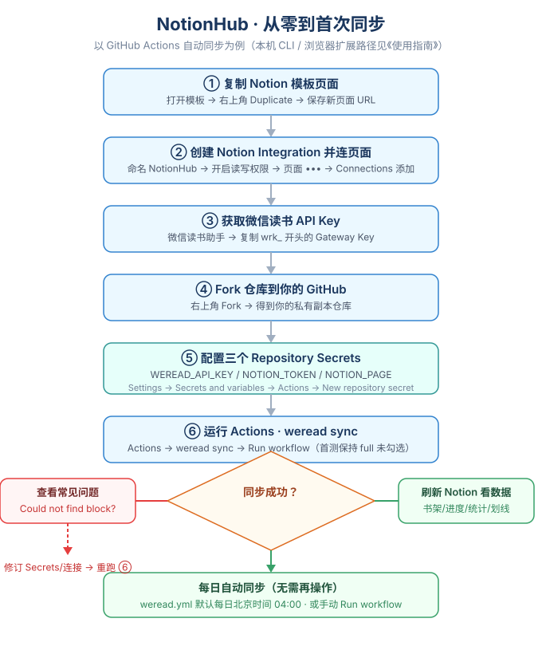
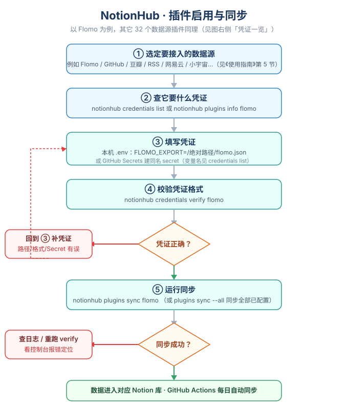

# NotionHub 使用操作指南







> 本指南面向「想真正用起来」的人：从零开始配置、日常怎么同步、怎么加别的数据源、出问题怎么办。



> 想了解架构与代码结构的，请看 [`FRAMEWORK_ANALYSIS.md`](FRAMEWORK_ANALYSIS.md) 与 [`ARCHITECTURE.md`](ARCHITECTURE.md)。







---







## 0. 它能做什么







NotionHub 把你的数字生活**单向同步**进一套 Notion 模板：







- **旗舰源 · 微信读书**：书架、阅读进度、章节化划线与笔记、阅读统计（日/周/月/年）、每日阅读快照。



- **33 个数据源插件**：Flomo、GitHub、豆瓣、RSS、Telegram、网易云、小宇宙、Apple Music、B站、Keep、Forest、滴答清单、多邻国、微博、小红书、Spotify、Strava、即刻、播客、日记……（见第 5 节）。







同步逻辑跑在**本机 CLI**（`weread2notion` 或 `notionhub` 命令），常用用法是「配置一次 → GitHub Actions 每天自动跑」。







---







## 1. 三种使用方式，先选一种







| 方式 | 适合谁 | 是否需要本机常驻 |



| --- | --- | --- |



| **A. GitHub Actions**（推荐） | 不想在自己电脑上长期跑程序的人 | 否，云端定时跑 |



| **B. 本机 CLI** | 想本地随时手动同步 / 调试的人 | 仅同步时运行 |



| **C. 浏览器扩展 / VS Code 扩展** | 想要图形面板点选触发的人 | 可选（扩展只做触发，逻辑仍跑 CLI） |







三者共用同一套配置（Notion 模板 + Token + 数据源凭证），可混用。下面先讲**无论哪种方式都必须做的首次配置**。







---







## 2. 首次配置（四步法，必做）







### 第 1 步：复制 Notion 模板



打开 [NotionHub 模板页](https://app.notion.com/p/wph/Template-3a329affe5af800b8581f98b71e948fb)，点击右上角 **Duplicate**，复制到你自己的 Workspace。



- 复制后保存**新页面的完整 URL**（下一步要用）。



- ⚠️ 必须使用你自己 Duplicate 出来的页面，**不要**填公共模板地址。







### 第 2 步：创建并连接 Notion Integration



1. 打开 [Notion Integrations](https://www.notion.so/profile/integrations) → **New integration**。



2. 名称填 `NotionHub`，Workspace 选模板所在的 Workspace。



3. Capabilities 勾选：**Read content / Insert content / Update content**。



4. 复制生成的 **Internal Integration Secret**（形如 `ntn_...` 或 `secret_...`），这就是 `NOTION_TOKEN`。



5. 回到你的 Notion 模板页面，右上角 `••• → Connections`，把 `NotionHub` 加进去。



   - 必须连到**最外层**模板页面，否则访问不到内部的书架/统计库和各书页面。







### 第 3 步：准备凭证



两种方式二选一：







- **（A 方式）Fork 到 GitHub 后，在 `Settings → Secrets and variables → Actions → New repository secret` 里建 3 个 secret**：







  | Secret | 内容 |



  | --- | --- |



  | `WEREAD_API_KEY` | 微信读书 Gateway API Key（[微信读书助手](https://weread.qq.com/r/weread-skills) 获取，以 `wrk_` 开头） |



  | `NOTION_TOKEN` | 上一步的 Integration Secret |



  | `NOTION_PAGE` | 第 1 步 Duplicate 后的页面 URL |







- **（B / C 方式）本机建 `.env` 文件**（项目根目录），内容见第 4 节。







> 安全红线：任何 Token / Key / Cookie 都**不要**写进代码、README 后提交；只放 GitHub Secrets 或本地 `.env`（`.env` 已被 git 忽略）。







### 第 4 步：跑一次同步验证



- **A 方式**：仓库 `Actions → weread sync → Run workflow`（首次**不要**勾 `full`）。



- **B 方式**：本机执行 `weread2notion sync`（需先装好包并配好 `.env`，见第 4 节）。



- 看到绿色成功后刷新 Notion 页面，书架/进度/统计应已出现；划线与笔记按章节进入各书正文。



- 首次运行会在主页底部自动创建「阅读快照」数据库。







> 首次配置「四步法」一览，照着走即可：







> 完整的「从零到首次同步」含 Fork / Secrets / 成功失败分支与每日自动同步，见下图：













---







## 3. 本机 CLI 安装与配置







### 3.1 安装 Python 包（让 `weread2notion` / `notionhub` 命令可用）



```bash



cd <项目根目录>



pip install -e .



```



装好后两个命令等价：`weread2notion` 与 `notionhub`（为兼容旧名与品牌名）。下文统一用 `notionhub`。







### 3.2 配置 `.env`（项目根目录）



最小可用配置（只同步微信读书）：







```dotenv



# 必填：微信读书同步必需



WEREAD_API_KEY=wrk_xxxxxxxxxxxxxxxx



# 必填：Notion Integration Secret（以 ntn_ 或 secret_ 开头）



NOTION_TOKEN=ntn_xxxxxxxxxxxxxxxxxxxxxxxxxxxxxxxx



# 必填：Duplicate 后的 Notion 模板页 URL 或页面 ID



NOTION_PAGE=https://www.notion.so/xxxxxx/3a329affe5af800b8581f98b71e948fb



```







常用可选配置（均有默认值，不填也行）：







| 变量 | 默认值 | 说明 |



| --- | --- | --- |



| `START_YEAR` | `2023` | 阅读统计起始年份（与 Notion「设置」库的「阅读统计起始年份」对应） |



| `CONCURRENCY` | `4` | 并发拉取书籍 bundle 的线程数 |



| `NOTION_REQUEST_INTERVAL` | `0.34` | 每次 Notion 请求的间隔秒数（限流保护） |



| `NOTION_VERSION` | `2026-03-11` | Notion API 版本（保持默认即可） |



| `BACKUP_DIR` | `backups` | 全量同步备份目录 |



| `CHECKPOINT_FILE` | `backups/.checkpoint.json` | 检查点续传文件 |



| `MAX_RETRIES` | `5` | 请求重试次数 |







> 注意：只有 `notionhub sync`（微信读书）**强制要求** `WEREAD_API_KEY`；`notionhub plugins sync --all`（其它数据源）不依赖它，未配也不报错、会自动跳过未配置的插件。







---







## 4. 命令速查表（日常最常用）







> 所有命令都依赖 `.env`（本机）或 GitHub Secrets（Actions）。







| 命令 | 作用 |



| --- | --- |



| `notionhub sync` | 增量同步（默认）：只更新变化书籍，自动清理已移出书架的书 |



| `notionhub sync --full` | 全量更新：先导出 JSON 备份再归档重建全部记录；终端会打印备份路径与回滚命令 |



| `notionhub sync --dry-run` | 只读预览同步计划，**不写入** Notion（无需联网连接） |



| `notionhub sync --quiet` | 关闭阶段进度，只输出最终结果 |



| `notionhub sync --verbose` | 开启调试日志（同时写入 `logs/`） |



| `notionhub sync --book <id>` | 只同步指定书籍（可多次 `--book`） |



| `notionhub sync --tag <标签>` | 只同步带指定标签的书（可多次 `--tag`） |



| `notionhub sync --no-self-heal` | 关闭失败自愈（默认失败会先 `repair --apply` 再重试一次） |



| `notionhub sync --source kindle:/path/MyClippings.txt` | 用 Kindle 标注文件作数据源（`apple:/x.csv`、`local:/dir` 同理） |



| `notionhub check` | 校验模板数据库与属性是否齐全 |



| `notionhub repair` | 仅**检测**数据不一致（设置库/快照缺失、过期正文、孤立记录等） |



| `notionhub repair --apply` | 在检测基础上**执行**修复 |



| `notionhub restore <备份.json>` | 从全量备份 JSON 取消归档被回收的页面（全量失败回滚用） |



| `notionhub status` | 工作区健康状态与待修复项（退出码 0=健康，1=待修复） |



| `notionhub export --target books --format csv` | 导出书架为 CSV / Markdown（`--target snapshots` 导出阅读快照，`--out` 指定路径） |



| `notionhub insights` | 阅读洞察汇总：总时长、连续/最长阅读天数、Top 书目、日均 |



| `notionhub credentials list` | 列出每个插件需要的凭证与 `.env` 键名 |



| `notionhub credentials verify [插件id]` | 校验当前 `.env` 已填的凭证格式是否正确 |



| `notionhub worker --interval 300` | 常驻进程，每 5 分钟自动同步（详见第 7 节） |







---







## 5. 启用更多数据源（插件）







NotionHub 把每个数据源都做成**插件**。启用一个插件 = 在 `.env` 里填它的凭证（GitHub Secrets 里建同名 secret 也行），然后运行对应同步命令。







### 5.1 常用插件与凭证一览







| id | 名称 | 类别 | `.env` 变量 | 凭证类型 |



| --- | --- | --- | --- | --- |



| weread | 微信读书 | 阅读 | `WEREAD_API_KEY` | API Key（`wrk_`） |



| flomo | Flomo | 笔记 | `FLOMO_EXPORT` | 本地导出文件路径 |



| github | GitHub Stars | 效率 | `GH_TOKEN` | OAuth Token |



| rss | RSS | 其他 | `RSS_FEEDS` | 多个 feed 地址（逗号分隔） |



| douban | 豆瓣 | 阅读 | `DOUBAN_BOOK_URLS` | 多个书目 URL（逗号分隔） |



| telegram | Telegram Saved | 笔记 | `TELEGRAM_EXPORT` | 本地导出 `result.json` |



| netease | 网易云歌单 | 影音 | `NETEASE_PLAYLIST` | 本地导出 JSON |



| xiaoyuzhou | 小宇宙 | 播客 | `XIAOYUZHOU_FEEDS` | 多个 RSS（逗号分隔） |



| keep | Keep | 运动 | `KEEP_EXPORT` | 本地导出 JSON |



| toggl | Toggl | 效率 | `TOGGL_API_TOKEN` | API Token |



| forest | Forest | 效率 | `FOREST_EXPORT` | 本地导出文件 |



| applemusic | Apple Music | 影音 | `APPLEMUSIC_EXPORT` | 本地导出 JSON |



| douyin | 抖音 | 影音 | `DOUYIN_EXPORT` | 本地导出 / Cookie |



| youtube | YouTube | 影音 | `YOUTUBE_EXPORT` / `YOUTUBE_API_KEY` | 导出文件 / API Key（均可选） |



| gutu | 古文岛 | 学习 | `GUTU_EXPORT` | 本地导出 JSON |



| trakt | Trakt | 影音 | `TRAKT_TOKEN` + `TRAKT_CLIENT_ID` | OAuth + API Key |



| dayone | 生成日记 | 效率 | `DAYONE_EXPORT` | 本地导出 JSON |



| ticktick | 滴答清单 | 待办 | `TICKTICK_EXPORT` | 本地导出 CSV |



| duolingo | 多邻国 | 学习 | `DUOLINGO_EXPORT` | 本地导出 JSON |



| bilibili | B站 | 影音 | `BILIBILI_EXPORT` | 本地导出 JSON |



| beidanci | 不背单词 | 学习 | `BEIDANCI_EXPORT` | 本地导出 JSON |



| spotify | Spotify | 影音 | `SPOTIFY_TOKEN`（`SPOTIFY_CLIENT_ID`+`SECRET` 可选） | OAuth / API Key |



| strava | Strava | 运动 | `STRAVA_TOKEN` | OAuth Token |



| weibo | 微博 | 笔记 | `WEIBO_UID`（`WEIBO_COOKIE` 可选） | UID / Cookie |



| xiaohongshu | 小红书 | 笔记 | `XIAOHONGSHU_EXPORT`（`COOKIE` 可选） | 导出文件 / Cookie |



| jike | 即刻 | 笔记 | `JIKE_EXPORT`（`COOKIE` 可选） | 导出文件 / Cookie |



| podcast | 播客（通用） | 播客 | `PODCAST_OPML` | OPML 路径 |



| applepodcast | Apple 播客 | 播客 | `APPLEPODCAST_OPML` | OPML 路径 |



| daily | 日记 | 笔记 | `DAILY_NOTES_DIR` | 按日期命名的文件目录 |



| daily-weather | 每日天气 | 其他 | `DAILY_WEATHER_LOCATION` | 经纬度 `lat,lon` |



| daily-location | 每日位置 | 其他 | `DAILY_LOCATION_LOCATION` | 经纬度 `lat,lon` |



| guwendao | 古文岛 | 学习 | `GUWENDAO_EXPORT` | 本地导出 JSON |



| fix | 修复工具 | 效率 | —（无需凭证） | 重跑各库 `ensure_database` 修复结构 |







> 「本地导出文件」类（Flomo / Telegram / Keep / 网易云 / Apple Music / 抖音 / 滴答 / 多邻国 / B站 / 百词斩 / 小红书 / 即刻 / 古文岛…）需先从对应 App 导出文件，把**绝对路径**填进 `.env`。



> 完整 33 个插件的字段含义以 `notionhub credentials list` 的实时输出为准。







### 5.2 插件相关命令



```bash



notionhub plugins list            # 列出所有插件及「已配置 / 未配置」状态



notionhub plugins info flomo       # 查看单个插件详情、所需凭证与使用文档链接



notionhub plugins sync flomo       # 只同步某一个已配置的插件



notionhub plugins sync --all       # 同步全部「已配置」插件（未配置自动跳过，不报错）



notionhub plugins sync --all --exclude weread   # 同步除微信读书外的所有已配置插件



notionhub credentials list         # 查看每个插件要填哪些 .env 键



notionhub credentials verify flomo # 校验 flomo 的凭证是否已正确填写



```



> GitHub Actions 里对应 `.github/workflows/sync.yml`（每日北京时间 05:00 对「所有已配置插件」执行 `plugins sync --all --exclude weread`）。







> 从一个数据源「接入到跑通」的完整路径见下图，照着走即可：















---







## 6. Notion「设置」库：细粒度开关







模板里的「设置」数据库 → 「同步设置」页面，控制同步行为。**改完下次普通同步即生效，通常无需 `--full`**。







| 设置项 | 默认 | 说明 |



| --- | --- | --- |



| 阅读完成进度强制改为100% | 关 | 人工标记读完的书在 Notion 显示 100%，不改微信读书真实进度 |



| 只同步我的书架书籍 | 开 | 仅保留微信读书当前书架的书；其余移入回收站 |



| 同步划线和笔记 | 开 | 按章节写入书籍正文 |



| 同步快照 | 开 | 生成每日/周期阅读快照（关可省 Notion 配额） |



| 同步阅读记录 | 开 | 同步日/周/月/年记录（关则跳过） |



| 同步人物卡片 | 开 | 生成书中人物卡片（大书目可关以加速） |



| 生成 AI 导读 | 关 | 需 `OPENAI_API_KEY`，开启后为每本书写一段 AI 导读 |



| 阅读统计起始年份 | 2023 | 从该年起生成统计（与 `.env` 的 `START_YEAR` 对应） |







> ⚠️ 开关只用 Checkbox 的 `true/false`；数值只用 Number。不要用字符串 `"true"`/`"false"` 或空串。系统维护的「同步配置版本（不可删除）」字段切勿手动改。







---







## 7. 四种触发方式







### 7.1 GitHub Actions（推荐，零常驻）



- 微信读书：`.github/workflows/weread.yml`，每日北京时间 **04:00** 定时；也可手动 `Run workflow` 或经 Webhook `repository_dispatch`（event_type `weread-sync`）触发。



- 其它插件：`.github/workflows/sync.yml`，每日北京时间 **05:00** 对「所有已配置插件」执行 `plugins sync --all --exclude weread`；支持单一插件选择或 Webhook（event_type `notionhub-sync`）。



- 失败会自动创建 Issue 通知。







### 7.2 本机 CLI



见第 3、4 节。适合临时调试、选择性同步、看日志。







### 7.3 浏览器扩展（Edge / Chrome）



1. `edge://extensions/` 开启「开发人员模式」→ 加载解压缩的扩展 → 选**项目根目录**（含 `manifest.json`）。



2. 点工具栏 **N** 图标（或 `Ctrl+Shift+H`）在新标签页打开控制面板。



3. 面板有四个标签页：`同步服务`（插件卡片墙，可配置/一键复制同步命令）、`账号`（Notion OAuth 登录并自动复制模板）、`通知`、`关于`。



4. 想让面板**直接读写 `.env` 并一键运行同步**，装本机桥接：



   ```powershell



   powershell -ExecutionPolicy Bypass -File native\install.ps1    # 安装（写 HKCU 注册表，探测 Python/扩展 ID）



   powershell -ExecutionPolicy Bypass -File native\uninstall.ps1  # 卸载



   ```



   未装桥接时面板自动降级为「复制命令到剪贴板」，不影响其它功能。



> 扩展只是**触发器 + 配置界面**，真正的同步仍由本机 `notionhub` CLI 执行；需先 `pip install -e .` 配好 `.env`。







### 7.4 自有 Worker（长毛象，完全脱离 GitHub）



常驻进程按固定间隔自动同步：



```bash



notionhub worker --interval 300          # 每 5 分钟同步一次（默认）



notionhub worker --interval 600 --once  # 只跑一轮（测试用）



notionhub worker --services flomo,github  # 只同步指定数据源



notionhub worker --mastodon              # 每轮结果以「嘟文」发布到 Mastodon（需配 MASTODON_INSTANCE + MASTODON_ACCESS_TOKEN）



```



> 5 分钟轮询会在每次执行时调用 `discover()`；若担心 API 消耗，可加大 `--interval`。







---







## 8. 日常维护与排错







| 场景 | 做法 |



| --- | --- |



| 想先看会同步什么、不改 Notion | `notionhub sync --dry-run` |



| 模板结构被改坏了 / 想重来 | `notionhub sync --full`（先备份再重建） |



| 全量同步失败想回滚 | `notionhub restore backups/xxx.json` |



| 怀疑数据不一致 | `notionhub check` 看库结构；`notionhub repair` 看报告；确认后 `notionhub repair --apply` |



| 想导出数据备份 | `notionhub export --target books --format csv` / `--target snapshots` |



| 看阅读统计 | `notionhub insights` |



| 健康巡检 / CI 判断 | `notionhub status`（退出码 0/1） |







**增量策略（理解后更好排查）**：同步分两级跳过无效写入——



1. **记录级**：按唯一键匹配已有记录（书架=`BookId`、快照=`日期:BookId`、统计=标题、阅读记录=时间戳、作者/分类=名称），未命中才创建。



2. **字段级**：命中后逐属性比对，只对真正变化的属性发更新；完全无变化连请求都不发。







**关键约定**：微信读书当前书架是同步范围的唯一依据。书从书架移除 → 下次成功同步把对应 Notion 页面/划线/笔记移入回收站。「已读」以微信读书书架的人工「读完」标记为准，不按进度推断。







---







## 9. 常见问题速查







**`Could not find block with ID`**



- `NOTION_PAGE` 是不是 Duplicate 后的新页面 URL？



- 页面 `••• → Connections` 是否加了 `NotionHub`？



- `NOTION_TOKEN` 是否属于该 Integration、且在同一 Workspace？







**日志里显示的 Integration 名称不对**



- 名称由 `NOTION_TOKEN` 决定；把 Token 换成你自己创建的 `NotionHub` Secret。







**「全部」视图没数据 / 阅读时长显示「还未阅读」**



- 确认用的是最新模板；重跑一次同步让同步器刷新字段。







**`NOTION_TOKEN` 报错格式不正确**



- 必须以 `ntn_` 或 `secret_` 开头（新版 Integration Secret 格式）。







**想加新数据源但列表里没有**



- 见第 10 节自己写一个插件；或检查 `.env` 是否已填对应凭证（未配置会被自动跳过）。







> 反馈问题请走 [GitHub Issues](https://github.com/wslh/NotionHub/issues/new/choose)，**不要**附任何 Key / Token / Cookie / `.env` 内容。







---







## 10. 给开发者：新增一个数据源（简述）







NotionHub 用「约定优于配置」：新插件只需声明库结构 + 实现取数，建库/同步/探测全复用基类。







1. 复制 `src/weread2notion/plugins/template.py` 为新文件。



2. 继承 `BasePlugin`，声明 `DB_NAME` / `TITLE_PROP` / `KEY_PROP` / `SCHEMA`，实现：



   - `is_configured()`：检查所需 `.env` 凭证是否存在；



   - `_items(ctx) -> Iterable[(key, raw)]`：产出「去重键 → 原始记录字典」。



3. 在 `src/weread2notion/plugins/__init__.py` 的 `_instances` 里注册。



4. 文本清洗 / 日期解析**务必复用** `src/weread2notion/utils.py` 的 `strip_html` / `parse_date_to_iso` / `parse_date_to_timestamp` / `parse_kindle_clipping_date`，不要重复实现。



5. 在 `tests/` 下用 `FakeNotion` 补测试（参考 `tests/test_plugin_framework.py`）。







详细约定见 `src/weread2notion/plugins/README.md` 与 `docs/ARCHITECTURE.md`。







---







*本指南对应项目版本：浏览器扩展 `manifest.json` v2.12.0；CLI 命令与 `.env` 键名以 `src/weread2notion/config.py`、`cli.py`、`credentials.py` 源码为准。*



